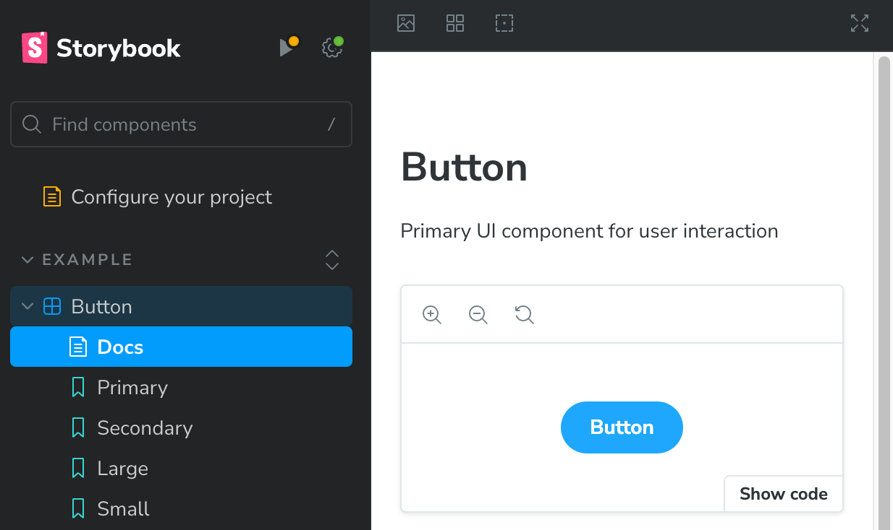
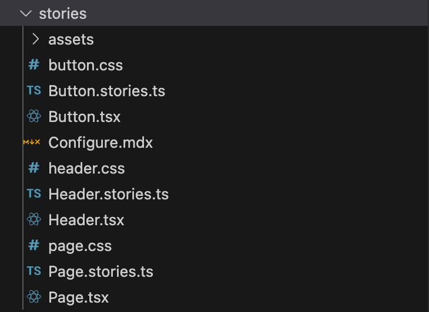
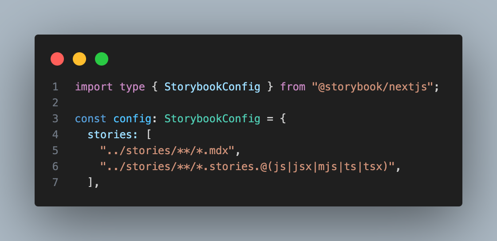

# Storybook Knowledge Sharing - Code examples

---

# Agenda

- A lot of code examples by use case
---

# How to create a storybook for a component

---

# How to include story files into Storybook

---

# .storybook/main.ts

---