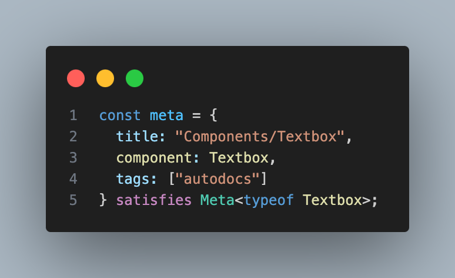

# Storybook Knowledge Sharing - Code examples

---

# Agenda

- Run storybook
- Basic configuration on stories path.
- Add a component to a storybook
- Add document automatically
- Add arguments to component
- Add mock action handler to arguments

---

# Exercise - Run storybook


`npm run storybook`

---

# Stoybook configuration

---

# .storybook/main.ts


---

# Exercise - Storybook configuration for exercises folder

Add *.stories in `exercises` folder in config file


---

# Storybook Meta and Story


---

# Add document automatically with autodoc

```
tags: ['autodocs']
```
---

# Add autodoc



---


# Note: Inline comment will not work as JSDoc


---

# Try to create a story for ToggleSwitch


---

# Study from examples in ./story folder